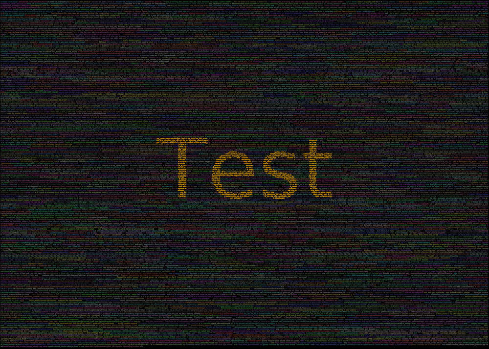
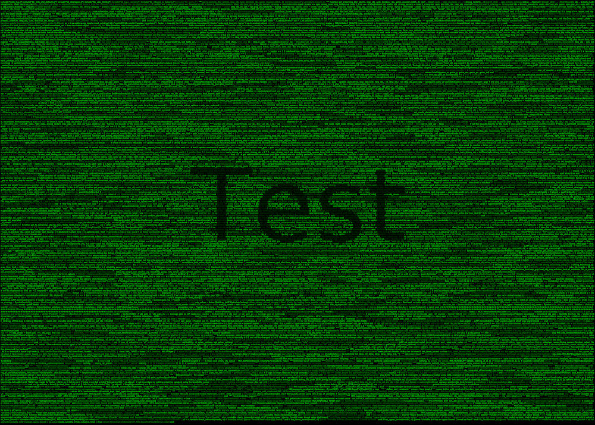

# CodePoster

You're proud of your new code project and just want to see it day and night? 
Make a poster out of your code with **CodePoster**.

If you want to read more about the project please check out my [blog post](http://opensourc.es/blog/codeposter)

## Possible results





## Installation 
This project uses [Julia](http://julialang.org) and the following extensions:
```
ArgParse
Colors
Luxor
Images
FileIO
```
which you can install by running `julia` and then `] add ArgParse Colors Luxor Images FileIO` where `]` gets you into the package manager.

## How to use
You need to be able to execute `poster.jl` so run sth like: `chmod +x poster.jl`

Then you have the following options:

```
usage: ./poster.jl -f FOLDER [--fsize FSIZE] [--ext EXT]
                 [--ignore IGNORE] [-t CENTER_TEXT]
                 [--fsize_text FSIZE_TEXT] [-c CENTER_COLOR]
                 [--code_color_range CODE_COLOR_RANGE] [--width WIDTH]
                 [--height HEIGHT] [--dpi DPI] [--start_x START_X]
                 [--start_y START_Y] [--line_margin LINE_MARGIN] [-h]

optional arguments:
  -f, --folder FOLDER   The code folder
  --fsize FSIZE         The font size for the code. Will be determined
                        automatically if not specified (type: Float64,
                        default: -1.0)
  --ext EXT             File extensions of the code seperate by , i.e
                        jl,js,py (type: Regex, default:
                        r"(\.jl|\.py|\.js|\.php)")
  --ignore IGNORE       Ignore all paths of the following form. Form
                        as in --ext (type: Regex, default:
                        r"(\/\.git|test|Ideas|docs)")
  -t, --center_text CENTER_TEXT
                        The text which gets displayed in the center of
                        your poster (default: "Test")
  --center_fsize CENTER_FSIZE_
                        The font size for the center text. (type:
                        Float64, default: 1400.0)
  -c, --center_color CENTER_COLOR
                        The color of center_text specify as r,g,b 
                        (type: RGB, default:
                        RGB{Float64}(1.0,0.73,0.0))
  --code_color_range CODE_COLOR_RANGE
                        Range for the random color of each code line
                        i.e 0.2-0.5                      for a color
                        between RGB(0.2,0.2,0.2) and RGB(0.5,0.5,0.5)
                        or 0.1-0.3,0.2-0.5,0-1 to specify a range for
                        r,g and b (default: "0.2-0.5")
  --width WIDTH         Width of the poster in cm (type: Float64,
                        default: 70.0)
  --height HEIGHT       Width of the poster in cm (type: Float64,
                        default: 50.0)
  --dpi DPI             DPI (type: Float64, default: 300.0)
  --start_x START_X     Start value for x like a padding left and
                        right (type: Int64, default: 10)
  --start_y START_Y     Start value for y like a padding top and
                        "bottom" (type: Int64, default: 10)
  --line_margin LINE_MARGIN
                        Margin between two lines (type: Int64,
                        default: 5)
  -h, --help            show this help message and exit
```

You need to specify the folder which contains your code and probably want to change the center text as well.

```
./poster.jl -f /path/to/folder -t TEXT
```

Additionally you can specify the size of the poster, the padding left/right and top/bottom the spacing between two lines, several colors, font sizes etc...

The following code was used for the matrix version which you can see above:

```
./poster.jl -f /path/to/folder --ext "(\.jl)" --code_color_range 0.0-0.0,0.4-0.9,0.0-0.0 -c 0,0.2,0
```

this includes only the Julia files in your code project and uses colors 
between `RGB(0,0.4-0.9,0)` for your code (randomly in that range) and the color of your center text is: `RGB(0,0.2,0)`. 